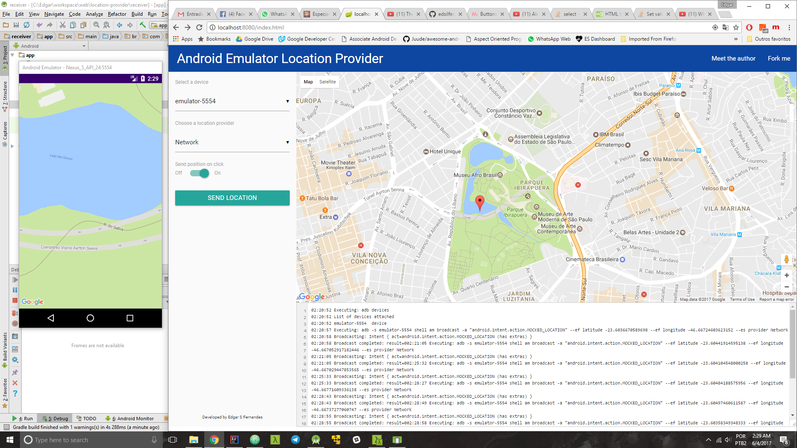

# Summary
1. [Introduction](#introduction) 
   * [Showcase](#showcase) 
   * [How it works?](#how-it-works) 
3. [Quick Setup](#setup)   
4. [License](#license)

<a name="introduction" />

# Introduction

While developing Location Aware software one might find that it is sometimes hard to test the behavior of their application with mocked data - the way your application perceives the sent mocked data will depended on the provider it is listening among other settings. For means to listen for location updates other that the new recommended [FusedLocationProviderAPI](https://developers.google.com/android/reference/com/google/android/gms/location/FusedLocationProviderApi), there are good tools around the web that might help you, among them, one can use the emulator itself or [this](https://github.com/dpdearing/android-gps-emulator) nice library that might delivery an even better job for those that need to test Geofencing Applications. However, if you are using the new [FusedLocationProviderAPI](https://developers.google.com/android/reference/com/google/android/gms/location/FusedLocationProviderApi) none of the previous solutions might work for you, and that's why this tool was written.

## Showcase

<p align="center">
  
  <br /><b>Figure 01:</b> location-provider lib with its server and client sides
</p>

<a name="how-it-works" />

## How it works?

The idea here is to use ADB commands to send mocked intents to a receiver application that you must install in order to correctly update your emulator location. In order to accomplish that, the following projects were created:
 1. **provider**: developed using Spring Boot, it provides a static web-page containing Google Maps. The user can choose among a list of settings in order to send the location of interest, picked from Google Maps, to the receiver application;
 2. **receiver**: an app that register a ```BroadcastReceiver``` that will parse the intents sent via ADB. Once the location data is retrived, it uses the methods provided by [FusedLocationProviderAPI](https://developers.google.com/android/reference/com/google/android/gms/location/FusedLocationProviderApi)  to set the mocked location.

<a name="setup" />

# Quick Setup
 1. Clone or download the project in your computer;
 2. Run the jar present on executable/ directory (```location-provider.jar```) with the command ```java -jar location-provider.jar```;
    * Go to Google Develop Console and create a project;
    * Activate Google Maps API for javascript in project libraries;
    * Replace ```YOUR_API_KEY``` by your recently created project id on ```executable/index.html```;
    * _**tip:** Run the given app on a terminal and check if everything went ok while server was going online_
 3. Acess the client on http://localhost:8080 ;
 4. Configure the client to react according the options:
    * Choose an active device that should receive the location updates - it wont work if you don't set a target device, even though there is only one;
    * Choose a Location provider from the combo-box;
    * Choose if you want that each click on the map generates a mocked location update;
 5. Configure Android Debug Bridge as an environment variable in your system - you must be able to access adb command from anywhere in your computer, otherwise this tool wont work properly;
 6. Open Android Studio and import the project ```receiver```;
    * Once gradle finishes its job, install the app on target device;
 7. On target device, accept the permissions (if in Android M+) and go to its configurations;
    * Enable the Developer Options - if it isn't enabled yet;
    * Go to ```Select mocked location app``` and pick ```location-receiver``` from the list;
 8. It is all set! You can now start sending the locations by clicking on the displayed map in your browser.
    * You can follow the execution of each command on the provided console in the client app;

**Important:** If you are going for running this project inside an IDE or if you want to customize it, don't forget to add ```google_maps_api.xml``` with the API in order to allow the receiver to use the Maps and see the effect of camera moving while the location is update. Also, this API must be set on ```index.html``` on its ```script``` tag for importing google maps.

<a name="license" />

# License
Copyright 2017 Edgar da Silva Fernandes

Licensed under the Apache License, Version 2.0 (the "License");
you may not use this file except in compliance with the License.
You may obtain a copy of the License at

    http://www.apache.org/licenses/LICENSE-2.0

Unless required by applicable law or agreed to in writing, software
distributed under the License is distributed on an "AS IS" BASIS,
WITHOUT WARRANTIES OR CONDITIONS OF ANY KIND, either express or implied.
See the License for the specific language governing permissions and
limitations under the License.
